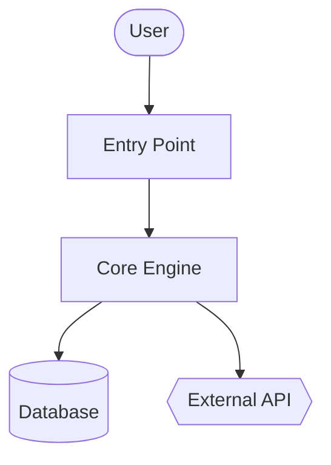
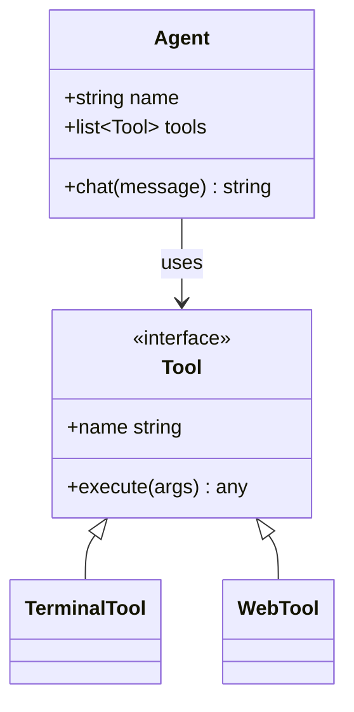
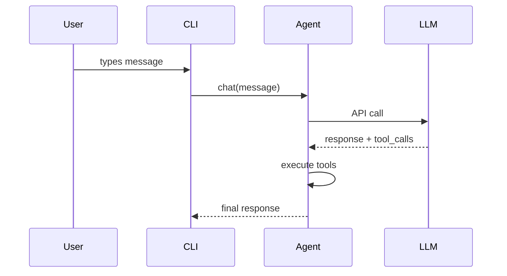

{/* 本页由 website/scripts/generate-skill-docs.py 根据技能的 SKILL.md 自动生成。请编辑源 SKILL.md，而非本页。 */}

# Code Wiki

为任意代码库生成 wiki 文档 + Mermaid 图表。

## 技能元数据

| | |
|---|---|
| Source | 可选 — 使用 `hermes skills install official/software-development/code-wiki` 安装 |
| Path | `optional-skills/software-development\code-wiki` |
| Version | `0.1.0` |
| Author | Teknium (teknium1), Hermes Agent |
| License | MIT |
| Platforms | linux, macos, windows |
| Tags | `Documentation`, `Mermaid`, `Architecture`, `Diagrams`, `Wiki`, `Code-Analysis` |
| Related skills | [`codebase-inspection`](/docs/user-guide/skills/bundled/software-development/software-development-codebase-inspection), `github-repo-management` |

## 参考：完整的 SKILL.md

:::info
以下是 Hermes 在触发本技能时加载的完整技能定义。这就是技能激活时智能体看到的指令内容。
:::

# Code Wiki Skill

为任意代码库生成完整的 wiki —— 概览、架构、各模块深度解析、Mermaid 类图与序列图。灵感来自 Google CodeWiki，但适用于本地仓库、私有仓库以及任何语言。仅使用现有的 Hermes 工具（`terminal`、`read_file`、`search_files`、`write_file`）；无需 Docker、无外部服务、无额外依赖。

本技能产出的是**参考文档**（是什么/怎么做）。它不产出战略叙述（为什么 —— 那是另一个技能的事）。

## 何时使用

- 用户说“给这个代码库写文档”“生成一个 wiki”“画架构图”
- 新加入一个不熟悉的仓库，需要一个结构化的参考
- 用户指向一个 GitHub URL 并请求文档
- 需要一个稳定产物（markdown + Mermaid），能在 GitHub 上渲染

不要用于以下场景：
- 单文件或单函数文档 —— 直接回答即可
- 针对某个具体接口的 API 参考 —— 使用 `read_file` 并直接回答
- 战略性的“为什么存在”叙述 —— 不同技能，不同目的
- 用户正在本次会话中积极开发的代码库 —— 有问题随问随答即可

## 前置条件

- 无需环境变量。
- PATH 中需有 `git`，用于追踪仓库 SHA 及远程克隆。
- 可选：`pygount` 用于语言分布统计（参见 `codebase-inspection` 技能）。

## 如何运行

从目标仓库根目录通过 `terminal` 工具调用，然后使用 `read_file` / `search_files` / `write_file` 生成 wiki。默认输出位置为 `~/.hermes/wikis/<repo-name>/`。仅在用户明确要求时才写入仓库（`docs/wiki/`）。

## 快速参考

| 步骤 | 操作 |
|---|---|
| 1 | 确定目标 —— 本地 cwd、给定路径，或 `git clone --depth 50 <url>` 到临时目录 |
| 2 | 扫描结构 —— `ls`、`find -maxdepth 3`、清单文件、README |
| 3 | 挑选 8–10 个要记录的模块 |
| 4 | 编写 `README.md`（概览 + 模块地图） |
| 5 | 编写 `architecture.md`，包含 Mermaid 流程图 |
| 6 | 在 `modules/` 中编写各模块文档 |
| 7 | 编写 `diagrams/class-diagram.md`（Mermaid classDiagram） |
| 8 | 编写 `diagrams/sequences.md`（Mermaid sequenceDiagram，2–4 个工作流） |
| 9 | 编写 `getting-started.md` |
| 10 | 如适用则编写 `api.md`，否则跳过 |
| 11 | 编写 `.codewiki-state.json` |
| 12 | 向用户报告路径 |

## 流程

### 1. 确定目标

对于 GitHub URL：

```bash
WIKI_TMP=$(mktemp -d)
git clone --depth 50 <url> "$WIKI_TMP/repo"
cd "$WIKI_TMP/repo"
REPO_SHA=$(git rev-parse HEAD)
REPO_NAME=$(basename <url> .git)
```

对于本地路径（未给定时用 cwd）：

```bash
cd <path>
REPO_SHA=$(git rev-parse HEAD 2>/dev/null || echo "uncommitted")
REPO_NAME=$(basename "$PWD")
```

然后设置输出目录：

```bash
OUTPUT_DIR="$HOME/.hermes/wikis/$REPO_NAME"
mkdir -p "$OUTPUT_DIR/modules" "$OUTPUT_DIR/diagrams"
```

### 2. 扫描仓库结构

使用 `terminal` 工具执行 shell 工作，使用 `read_file` 读取清单文件：

```bash
# Shallow tree first
ls -la

# Deeper tree, noise filtered
find . -type d \
  -not -path '*/\.*' \
  -not -path '*/node_modules*' \
  -not -path '*/venv*' \
  -not -path '*/__pycache__*' \
  -not -path '*/dist*' \
  -not -path '*/build*' \
  -not -path '*/target*' \
  -maxdepth 3 | sort

# Language breakdown (skip if pygount unavailable)
pygount --format=summary \
  --folders-to-skip=".git,node_modules,venv,.venv,__pycache__,.cache,dist,build,target" \
  . 2>/dev/null || true
```

然后使用 `read_file` 读取相关的清单文件（`package.json`、`pyproject.toml`、`setup.py`、`Cargo.toml`、`go.mod`、`pom.xml`、`build.gradle`）以及项目 README。使用 `search_files target='files'` 来查找它们，而不是猜测文件名。

### 3. 选择要记录的模块

初始扫描上限为 **8–10 个模块**。按语言的经验法则：

- Python：顶层包（含 `__init__.py` 的目录），加上子系统目录
- JS/TS：`src/<subdir>`，顶层工作区目录
- Rust：工作区中的每个 crate，或顶层 `src/<module>` 目录
- Go：每个顶层包目录
- 混合/不熟悉的情况：包含源代码的顶层目录（不是配置，不是测试）

对于非常大的仓库，按以下优先级排序：
1. 被导入次数（被大量导入的模块是核心）
2. 代码行数（较大的模块通常值得单独记录）
3. README / 顶层文档中的提及次数

在大型仓库上，在生成每个模块的文档之前，先向用户说明模块列表——给他们一个调整方向的机会。

### 4. 编写 `README.md`

使用 `read_file` 读取实际的项目 README 以及前 2–3 个入口文件。然后使用 `write_file`：

````markdown
# <Project Name>

<One paragraph: what it is and what it's for. Self-contained — don't assume the
reader has the source README.>

## Key Concepts

- **<Concept 1>** — <one line>
- **<Concept 2>** — <one line>

## Entry Points

- [`path/to/main.py`](https://github.com/NousResearch/hermes-agent/blob/main/optional-skills/software-development\code-wiki/<link>) — <what runs when you start it>
- [`path/to/cli.py`](https://github.com/NousResearch/hermes-agent/blob/main/optional-skills/software-development\code-wiki/<link>) — <CLI surface>

## High-Level Architecture

<2-3 sentences. Detail goes in architecture.md.>

See [architecture.md](https://github.com/NousResearch/hermes-agent/blob/main/optional-skills/software-development\code-wiki/architecture.md).

## Module Map

| Module | Purpose |
|---|---|
| [`<module>`](https://github.com/NousResearch/hermes-agent/blob/main/optional-skills/software-development\code-wiki/modules/<module>.md) | <one-line purpose> |

## Getting Started

See [getting-started.md](https://github.com/NousResearch/hermes-agent/blob/main/optional-skills/software-development\code-wiki/getting-started.md).
````

在本地模式下，链接目标使用相对路径。对于克隆的仓库，使用 `https://github.com/<owner>/<repo>/blob/<sha>/<path>`，这样链接在未来的提交中仍然有效。

### 5. 编写 `architecture.md`

````markdown
# Architecture

<2-3 paragraphs: shape of the system. What talks to what. Where data enters,
where it exits, where state lives.>

## Components

- **<Component>** — <1-2 sentences>. See [`modules/<module>.md`](https://github.com/NousResearch/hermes-agent/blob/main/optional-skills/software-development\code-wiki/modules/<module>.md).

## System Diagram



## Data Flow

1. **<Step>** — [`<file>`](https://github.com/NousResearch/hermes-agent/blob/main/optional-skills/software-development\code-wiki/<link>)
2. **<Step>** — [`<file>`](https://github.com/NousResearch/hermes-agent/blob/main/optional-skills/software-development\code-wiki/<link>)

## Key Design Decisions

- <Anything load-bearing the reader should know>
````

**Mermaid 形状语义：**
- `[]` = 组件
- `[()]` = 数据库 / 存储
- `{{}}` = 外部服务
- `(())` = 入口点或终点
- `-->` = 同步调用，`-.->` = 异步/事件

每个图最多约 20 个节点。如果更大，拆分为子图。

### 6. 在 `modules/` 中编写按模块划分的文档

对于每个选定的模块，使用 `ls` 检查其布局，识别出 3–5 个最重要的文件（按大小、是否命名为 `core.py` / `main.py` / `__init__.py`、是否被大量导入来判断），然后 `read_file` 读取这些文件（使用 `offset` / `limit` 只读取所需内容；对于特定符号优先使用 `search_files`）。

````markdown
# 模块：`<module>`

<1-2 句说明用途。>

## 职责

- <要点>
- <要点>

## 关键文件

- [`<module>/<file>`](https://github.com/NousResearch/hermes-agent/blob/main/optional-skills/software-development\code-wiki/<link>) — <它的作用>

## 公开 API

<其他代码使用的函数/类/常量。将相关项分组。展示
签名，而非完整实现。>

## 内部结构

<模块内部如何组织。状态管理。>

## 依赖

- **被谁使用：** <其他模块>
- **使用了：** <其他模块 + 外部库>

## 值得注意的模式 / 陷阱

- <任何不明显的内容>
````

### 7. 编写 `diagrams/class-diagram.md`

挑选 5–10 个最重要的类/类型。`read_file` 读取它们，然后写：

````markdown
# 类图

## 核心类型



## 备注

<图无法表达的任何内容 — 生命周期、线程等。>
````

对于没有类的语言（Go、C、Rust）：使用该图表示结构体关系，或跳过 class-diagram.md 并在 architecture.md 中用散文解释。不要强行套用。

### 8. 编写 `diagrams/sequences.md`

挑选 2–4 个最重要的工作流。追踪每个调用路径穿过代码（读取入口点，跟随函数调用），然后：

````markdown
# 时序图

## 工作流：<名称>

<1 句描述它做什么以及何时运行。>



### 走读

1. **用户输入** — [`cli.py:HermesCLI.run_session`](https://github.com/NousResearch/hermes-agent/blob/main/optional-skills/software-development\code-wiki/<link>)
2. **消息分发** — [`run_agent.py:AIAgent.chat`](https://github.com/NousResearch/hermes-agent/blob/main/optional-skills/software-development\code-wiki/<link>)
````

不要虚构参与者。每一个方框都必须对应读者能在代码中找到的真实组件。

### 9. 编写 `getting-started.md`

````markdown
# 入门

## 前置条件

<来自清单文件 + README。要具体 — 若有固定版本则写明版本。>

## 安装

```bash
<准确命令>
```

## 首次运行

```bash
<让系统做出有用事情的最小命令>
```

## 常见工作流

### <工作流 1>
<命令>

## 配置

- `<config-file>` — <它控制什么>
- 环境变量 `<VAR>` — <它控制什么>

## 接下来去哪里

- 架构：[architecture.md](https://github.com/NousResearch/hermes-agent/blob/main/optional-skills/software-development\code-wiki/architecture.md)
- 模块参考：[README.md#module-map](https://github.com/NousResearch/hermes-agent/blob/main/optional-skills/software-development\code-wiki/README.md#module-map)
````

### 10. 编写 `api.md`（不适用则跳过）

仅在项目是库或 API 服务器时才编写此文件。如果是：

- 找到公开 API 范围（`__init__.py` 导出、OpenAPI 规范、路由处理器、导出的类型）
- 记录每个公开条目，包含签名、参数、返回类型、一行描述
- 按类别分组

### 11. 编写状态文件

```bash
cat > "$OUTPUT_DIR/.codewiki-state.json" <<EOF
{
  "repo_name": "$REPO_NAME",
  "source_path": "$PWD",
  "source_sha": "$REPO_SHA",
  "generated_at": "$(date -u +%Y-%m-%dT%H:%M:%SZ)",
  "generator": "hermes-agent code-wiki skill v0.1.0",
  "modules_documented": []
}
EOF
```

### 12. 向用户报告

准确说明生成了什么以及位置：

```
Generated wiki at ~/.hermes/wikis/<repo-name>/:
  README.md                   project overview, module map
  architecture.md             system architecture + flowchart
  getting-started.md          setup, first run, workflows
  modules/<N files>           per-module deep-dives
  diagrams/architecture.md    Mermaid flowchart
  diagrams/class-diagram.md   Mermaid class diagram
  diagrams/sequences.md       Mermaid sequence diagrams
```

如果你克隆到了临时目录，提醒用户在评审完 wiki 之后可以移除它（`rm -rf "$WIKI_TMP"`）。

## 范围控制

为 50 万行的 monorepo 生成完整 wiki 会极其消耗 token。默认采用有界范围：

- 初始扫描：最大深度 3 层目录
- 按模块文档：除非用户扩展范围，否则上限 10 个模块
- 按文件读取：优先使用 `search_files` 查找符号 + 带 `offset`/`limit` 的 `read_file`，而非完整读取
- 跳过 vendored 代码（`vendor/`、`third_party/`、生成代码、`_pb2.py`、`.min.js`）

如果用户说“详尽地做整个东西”，相信他们 — 但先粗略估算成本：“这个仓库约有 340 个源文件，全面覆盖会很昂贵 — 确认？”

## 重新运行 / 更新

如果目标路径上已存在 `.codewiki-state.json`：

- 读取它获取之前的 SHA 和模块列表
- 如果源码 SHA 匹配：询问用户是重新生成还是跳过
- 如果 SHA 不同：提议只重新生成有文件变更的模块（`git diff --name-only <old-sha> HEAD`）

完全增量式重新生成为未来增强功能 — 目前，重新生成整个内容是可行的。

## 陷阱

- **虚构组件。** 每一个图示节点和声称的函数调用都必须在源码中。写入前先 `read_file`。自动生成文档的最大失败模式就是听起来合理的虚构。
- **泛化的 AI 散文。** “This module is responsible for...” 是毫无内容的。用领域特定术语说明模块实际做什么。
- **把代码改写成散文。** 一个说“the `process` function processes things by calling `process_item` on each item”的模块文档比直接链接到该函数更糟。
- **Mermaid 超过 50 个节点。** 它们渲染出来无法辨认。拆分它们。
- **把测试、生成代码或 vendored 依赖当作产品代码来记录。** 跳过它们。
- **未经请求就输出到仓库内。** 默认是 `~/.hermes/wikis/`。仅在用户明确要求时才写入仓库。
- **Mermaid 特殊字符需要引号：** `A["Tool / Agent"]` 而非 `A[Tool / Agent]`。节点内换行用 `<br>`。
- **SKILL.md 中的嵌套代码围栏。** 编写包含 Mermaid 块的 markdown 示例时，使用 4 反引号的外层围栏，这样内层 3 反引号的 ` ```mermaid ` 不会关闭外层。（本 SKILL.md 就是这样做的。）
- **classDiagram 泛型** 渲染为 `~T~`（例如 `List~Tool~`），而非 `<T>`。
- **GitHub Mermaid 主题是固定的** — 不要包含 `%%{init: ...}%%` 块；它们渲染时会被剥离。

## 验证

写入后，验证：

1. **Mermaid 块配平** — 每个文件中开启与闭合相等：
   ```bash
   for f in "$OUTPUT_DIR"/diagrams/*.md "$OUTPUT_DIR"/architecture.md; do
     opens=$(grep -c '^```mermaid' "$f")
     total=$(grep -c '^```' "$f")
     echo "$f: $opens mermaid blocks, $total total fences (expect total = opens*2)"
   done
   ```
2. **所有预期文件都存在** —
   ```bash
   ls "$OUTPUT_DIR"/{README.md,architecture.md,getting-started.md,.codewiki-state.json} \
      "$OUTPUT_DIR"/modules/ "$OUTPUT_DIR"/diagrams/
   ```
3. **模块数量与你预期的匹配** — `ls "$OUTPUT_DIR/modules" | wc -l` 应等于你在第 3 步中承诺的模块数。
4. **没有虚构路径** — 抽查 2–3 个源码链接能解析到真实文件。
